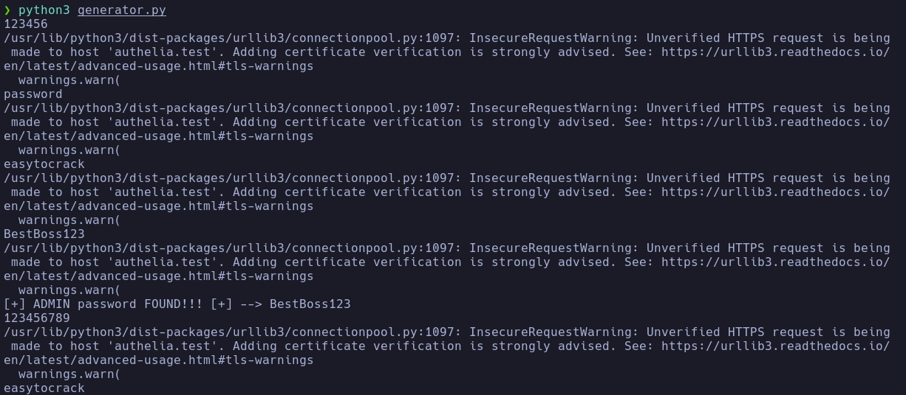
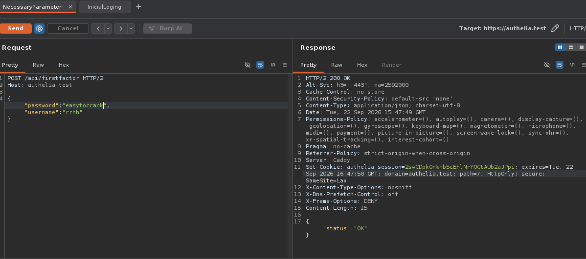
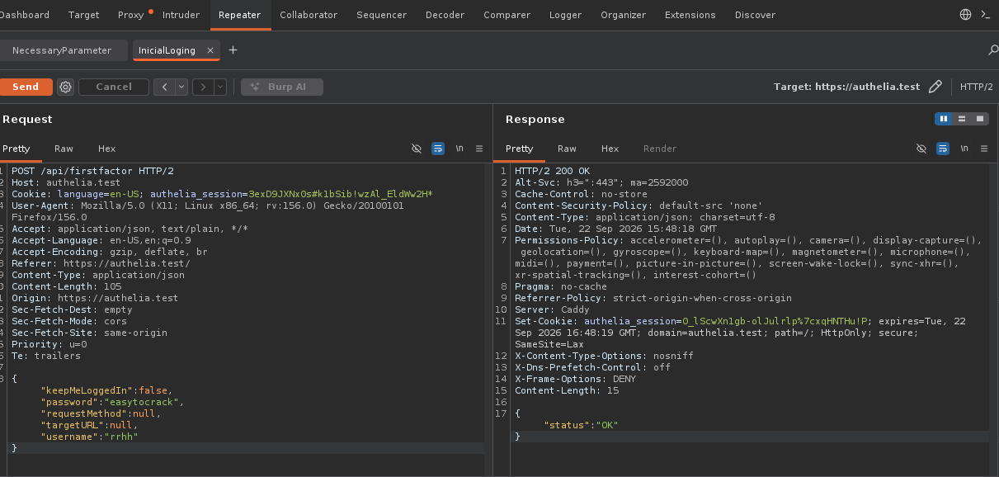
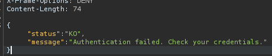
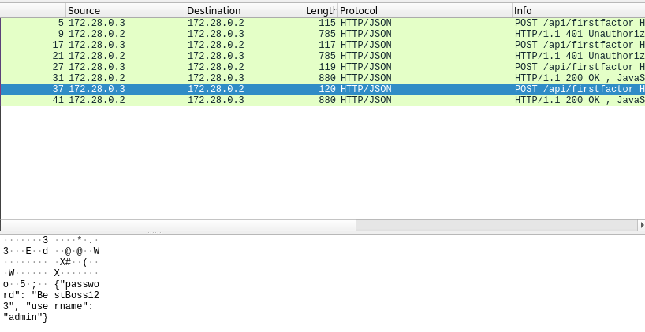

# Attack: Rate Limiting Bypass via Counter Reset Logic Flaw

In this part we simulate an atack as a pentester.

This document describes the technical implementation of a brute-force attack against the `admin` user in Authelia, abusing a logic flaw in the IP banning mechanism. It is part of the [SIEM-RateLimit-Bypass-Lab](../README.md) lab.

## 🎯 Specific objective

Automate a brute-force attack against the `admin` user on Authelia's `authelia.test/api/firstfactor` endpoint, avoiding IP banning by using valid credentials from a low-privileged user (`rrhh`) that reset the failed-attempt counter.

## 🧠 Exploited vulnerability

- **Type:** Business Logic Flaw.
- **Description:** I modified this lab for this atack, now Authelia applies rate limiting that bans an IP after 3 failed attempts for 60 seconds. However, a successful login resets the failure counter to 0. The attacker knows valid credentials for a low-privilege user (`rrhh:easytocrack`) and inserts them every 2 failed attempts to reset the counter and avoid the ban.
- **Attack pattern:** `failure, failure, success(rrhh), failure, failure, success(rrhh), ...`
- **Impact:** Allows unlimited brute force against the `admin` password without being banned. Administrator credentials were obtained.

## 🧰 Attack environment

- **Attacker machine:** Kali Linux — 172.28.0.3 docker ip
- **Victim machine:** Authelia v3.8 on Docker
- **Network:** same networkd (127.0..0.1) stableced in the /etc/host as authelia.test
- **Modification:** Authelia's authentication method was modified to introduce the counter reset vulnerability.

## 🐍 Attack script

**Location:** [`bypass_rate_limit.py`](./exploit/bypass_rate_limit.py)

**Dependencies:** See [`requirements.txt`](./exploit/requirements.txt)

**Usage:**

```bash
python3 bypass_rate_limit.py 2>/dev/null | tee result.txt
```

Parameters configurable inside the script:

- url: Authelia endpoint (https://authelia.test/api/firstfactor)
- valid credentials: reset user and password (rrhh:easytocrack)
- target user: admin

## 🔬 Step-by-step methodology

**Manual reconnaissance with Burp Suite:**

- Intercept the login request to identify the required parameters.
- Confirm that the request is POST, in JSON format, and that it does not accept GET or downgrade to HTTP/1.1 (it stays on HTTP/2).
- Verify that Authelia returns `{"status":"OK"}` on success and `{"status":"KO"}` on failure, with HTTP status code 401 in both cases.
- I could make an snipper atack but i prefert to do it by myself to undertand how this atack it works.

**Logic flaw analysis:**

- Test the pattern `failure, failure, success(rrhh)` and verify that the counter is reset.
- Confirm that banning never occurs if successful logins are interleaved.
- Deduce the pattern from a previous HackTheBox machine, replicating the vulnerability in Authelia.

** Debugging notes**

- Initial version: POST requests with `requests`, detecting success by status code 200 and `status: OK`.
- Problem 1: output errors accompanied the responses. Solution: `2>/dev/null`.
- Problem 2: data had to be sent as JSON, not as a form. Discovered with Burp Suite and only accepts method POST, not GET.
- Problem 3: the wordlist had line breaks. Solution: `.strip()`.
- Problem 4: when applying the reset on the third attempt, one password was skipped. Solution: save the skipped password and append it to the end of the iterable (Python allows modifying an iterable while iterating), my advice is to segmend the passwords all as you can.

**Attack execution:**

- Wordlist: 100 segmented passwords from `rockyou.txt`, filter by commons admin passwords.
- The correct password was deliberately inserted on line 4 to speed up the process.
- Result: admin credentials found in less than 2 seconds.

## 📊 Results obtained

Note: The correct password was deliberately placed early in the wordlist to speed up the proof of concept. In a real scenario, this attack could take minutes or hours depending on password complexity and wordlist size.

| Metric | Value |
|---|---|
| Total POST requests captured | 4 |
| Failed attempts against admin | 2 |
| Successful logins with rrhh | 1 |
| Successful login with admin | 1 |
| Total time | < 1 second |
| Bans triggered | 0 (only in initial testing phases) |

**Credential found:**

```text
admin : BestBoss123
```
## Evidence

### Successful brute force



### Minimal request in Burp

Only `username` and `password` are required. No cookies, no extra headers. But so important, it has to be in JSON format



### Authentication response

Authelia returns `{"status":"OK"}` on success and `{"status":"KO"}` on failure. We get a "401 Unauthorized" if the credentials are wrong.




### Ban behavior

When the ban is triggered, Authelia still returns `401 Unauthorized` with
the same message as a normal failed attempt:

    {"status":"KO","message":"Authentication failed. Check your credentials."}

But if you get banned "401 Unauthorized" doesn't change, so SIEM cannot rely on
response semantics to spot the attack, in this case we can say this was a **blind bypass brute force attack**

## 🌐 Network capture (pcap)

### Capture command

```bash
sudo tcpdump -i any -nn -s0 -w attack9091.pcap 'tcp port 9091```

### Analysis with Wireshark

Filter used to isolate the attack traffic:

```
wireshark &>/dev/null & disown

```

### Key findings

- **POST requests** to `/api/firstfactor` with JSON payloads containing `username` and `password`.
- **HTTP status codes:** `200 OK` on success, `401 Unauthorized` on failure and on ban.
- **Timing pattern:** `failure, failure, success(rrhh), failure, failure, success(rrhh), ...`
- **Payload example:**

```json
{"username":"admin","password":"BestBoss123"}
```

- **Reset request example:**

```json
{"username":"rrhh","password":"easytocrack"}
```

### Screenshots from Wireshark


### Extracted data with tshark

```
tshark -r attack9091.pcap -Y 'http.request.method == "POST"' -T fields -e frame.time -e ip.src -e http.file_data
```

| Timestamp | Source IP | Payload |
|---|---|---|
| 2026-09-26 09:13:24.693727 | 172.28.0.3 | `{"password": "123456", "username": "admin"}` |
| 2026-09-26 09:13:24.974720 | 172.28.0.3 | `{"password": "password", "username": "admin"}` |
| 2026-09-26 09:13:25.264501 | 172.28.0.3 | `{"password": "easytocrack", "username": "rrhh"}` |
| 2026-09-26 09:13:25.555158 | 172.28.0.3 | `{"password": "BestBoss123", "username": "admin"}` |


## 📁 Generated artifacts

- `Content/screenshots/` — Burp Suite screenshots (status codes), script output (before and after debugging), access to the panel as admin, and Wireshark captures.
- `exploit/result.txt` — Script output with the attack result.
- `exploit/attack9091.pcap` — Network capture with tcpdump.

## 📝 Observations for the defensive phase

- Authelia does not distinguish in the HTTP response between a normal failure and a ban: both return `401 Unauthorized` with `{"status":"KO","message":"Authentication failed..."}`. Therefore, the SIEM cannot rely on response semantics to detect the attack. It is a **blind bypass brute-force attack**.
- **Detectable pattern:** admin failures followed by an rrhh success from the same IP. The frequency must be constant.
- **Potential evasion:** the attacker could add random delays between requests to evade frequency-based detection and change IP constantly.
- **Improvement proposals:**
  - Rate limiting should not be reset by a successful login from another user.
  - Implement 2FA for the admin user.
  - Add the admin's User-Agent as an additional validation parameter.
  - Monitor failure + success sequences from the same IP, even if they do not exceed the ban threshold.

## 🔗 Related links

- [General lab README](../README.md)
- [Defensive phase](../SOC_analyst/README.md)
- [Attack script](./exploit/bypass_rate_limit.py)
- [Dictionay used](./exploit/dictionary.txt)
