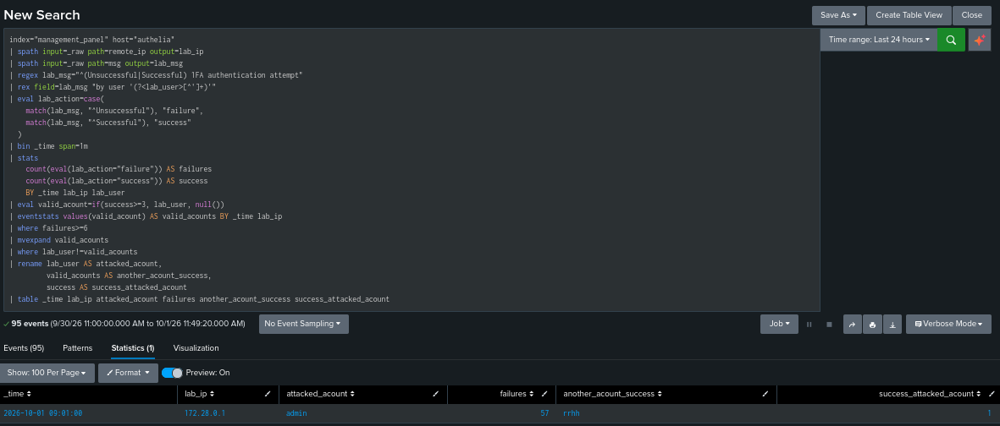
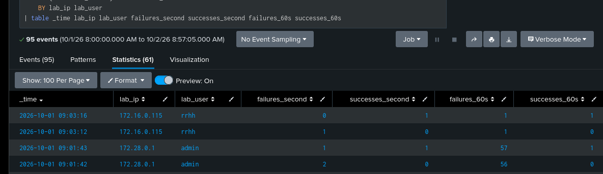

## Context

Before looking for events, I made some login requests using other IPs. 172.16.0.115 will be from RRHH and 172.16.0.130 will be from the admin. So we have to assume that the hacker can't change their IP, well, they can, but we use a Caddy proxy to deny the param "X-Forwarded-For" so that only the real IP is received. So I made this to filter and differentiate between false positives.

172.16.0.115 -> user: RRHH
172.16.0.130 -> user: admin
172.28.0.1 ---> user: Pentester

## Objectives

My objective is to detect and analyze suspicious authentication activity, and to document a reproducible response with evidence.

## Telemetry

So as I said before, we need to be organized, so I will start by looking at the telemetry that we get.


Then I will apply a regex and change some variable names using Splunk SPL to make this clearer.

```spl
index="management_panel" host=authelia | spath input=_raw path=remote_ip output=lab_ip | spath input=_raw path=time output=lab_time | spath input=_raw path=msg output=lab_msg | regex lab_msg="^(Unsuccessful|Successful) 1FA authentication attempt" | rex field=lab_msg "by user '(?<lab_user>[^']+)'" | eval lab_action=case(match(lab_msg, "^Unsuccessful"), "failure", match(lab_msg, "^Successful"), "success") | sort 0 lab_time| table lab_time lab_ip lab_user lab_action
```


At this point I'm gonna filter by ip, users, and how many failure and successful

```spl
index="management_panel" host="authelia" | spath input=_raw path=msg output=lab_msg | spath input=_raw path=remote_ip output=lab_ip | regex lab_msg="^(Unsuccessful|Successful) 1FA authentication attempt" | rex field=lab_msg "by user '(?<lab_user>[^']+)'" | eval lab_action=case(match(lab_msg, "^Unsuccessful "), "failure", match(lab_msg, "^Successful "), "success") | stats count AS resultados by lab_ip lab_user lab_action | sort lab_ip lab_user lab_action
```
We can observe that something goes wrong... why is there many failure attempts of user admin, and also all this massive failure error come from one specific IP


We got:

| Users | Failure | Success |
|-------|---------|---------|
| rrhh  | 3       |   31    |
| admin | 59      |   2     |

## Chronology

At this point I'll review the autentications chronology by IP. I observe that there a intercalation between users acounts during the lab.
My hypothesis is that one IP could be getting a lot of failures agains an acount and success access repeaded with another account showing an unusual pattern. Why? maybe to avoid the rate limit ban wheel guess random passwords.

Atlist to me this could be a kind of "Possible force brute with interspersing valid autentications" I can't ignore this unusual bahavior

During a block of 60sec I'll look for this coincidences

| Condition | Initial Proposal |
|-----------|------------------|
| Origin | Same IP |
| Failed attempts | At least 6 failures against the same account A |
| Successful authentications | At least 3 successes with an account B different from A |
| Time relationship | Both behaviors within the same window |

This allows me to detect the behavior even if the attacker has not yet guessed the correct password. If a successful login does occur, we will check its timing relative to the failed attempts and determine whether the protected resource was subsequently accessed.

So I filter this with the next SPL consult:

```spl
index="management_panel" host="authelia"
| spath input=_raw path=remote_ip output=lab_ip
| spath input=_raw path=msg output=lab_msg
| regex lab_msg="^(Unsuccessful|Successful) 1FA authentication attempt"
| rex field=lab_msg "by user '(?<lab_user>[^']+)'"
| eval lab_action=case(
    match(lab_msg, "^Unsuccessful"), "failure",
    match(lab_msg, "^Successful"), "success"
  )
| bin _time span=1m
| stats
    count(eval(lab_action="failure")) AS failures
    count(eval(lab_action="success")) AS success
    BY _time lab_ip lab_user
| eval valid_acount=if(success>=3, lab_user, null())
| eventstats values(valid_acount) AS valid_acounts BY _time lab_ip
| where failures>=6
| mvexpand valid_acounts
| where lab_user!=valid_acounts
| rename lab_user AS attacked_acount,
         valid_acounts AS another_acount_success,
         success AS success_attacked_acount
| table _time lab_ip attacked_acount failures another_acount_success success_attacked_acount
```

| Instruction | Function |
|-------------|----------|
| `bin _time span=1m` | Groups times into one-minute blocks. |
| `stats ... BY _time lab_ip lab_user` | Counts failures and successes per minute, IP, and account. |
| `eval valid_acount=if(...)` | Marks accounts with at least three successes. |
| `eventstats values(...)` | Adds those accounts to rows of the same minute and IP, preserving each user's counts. |
| `where failures>=6` | Keeps accounts with six or more failures. |
| `mvexpand valid_acounts` | Creates one row per candidate account with successes. |
| `where lab_user!=valid_acounts` | Requires that the account with successes is different from the account with failures. |

This filter its me firts detection consult, This filter use blocks of 1 minute, for exemple "13:01:00" before of "13:02:00". Still is not a real time move of 60 seconds

So doing this we got the next capture:




The appearance of "rrhh" in that column indicates that at least three successes were achieved in that block. The "1" in the last column corresponds to the success in "admin".

The query identified the attacker's IP address through 57 failed attempts against the "admin" account and repeated successful authentications for the "rrhh" account within the same minute. It also showed a successful login for "admin".

Now, at this point I need to calculate the 60sec move recounts.  

changes on the filter:

. remove bin _time span=1m : no longer split the attack by clock minutes.

. stats ... BY _time lab_ip lab_user : groups events from the same account and IP that share a timestamp. Since this logs have second precision, I count together the events of that second, without inventing their order.

sort 0 _time: sorts chronologically before computing.

streamstats time_window=60s : adds up the counts from the last 60 seconds, including the current row and separating each combination of IP and account.

```spl
index="management_panel" host="authelia" 
| spath input=_raw path=remote_ip output=lab_ip
| spath input=_raw path=msg output=lab_msg
|regex lab_msg="^(Unsuccessful|Successful) 1FA authentication attempt"
| rex field=lab_msg "by user '(?<lab_user>[^']+)'"
| eval lab_action=case(
match(lab_msg, "^Unsuccessful"), "failure",
match(lab_msg, "^Successful"), "Success"
)
| stats 
   count(eval(lab_action="failure")) AS failures_second 
   count(eval(lab_action="success")) AS success_second
   BY _time lab_ip lab_user
| sort 0 _time
| streamstats time_window=60s
    sum(failures_second) AS failures_60s
    sum(success_second) AS successes_60s
    BY lab_ip lab_user 
| table _time lab_ip lab_user failures_second success_second failures_60s successes_60s
```

This query is an intermediate check: it does not yet relate the failures of one account to the successes of another. First we check these counters, then we will complete that relationship within the same window.

In the previous rows, successes_60s of admin is worth 0 because its successful authentication had not yet been registered. At 09:01:43 it goes to 1. In addition, the counters are separated by IP and account: the 28 HR hits from the attacking IP appear in their own ranks, they do not add to the admin successes.




The query identified the activity of 172.28.0.1:

- 57 failures against admin.

- 28 successes with rrhh.

- 1 success with admin.

The first match appeared at 09:01:20, before the admin success registered at 09:01:43, according to the time shown in Splunk.


## Notes:

I had problems with the interpreter time, it was desynchronized by seconds between Splunk and Authelia time logs. The solution was changing the time parameters of Splunk and restarting it.


