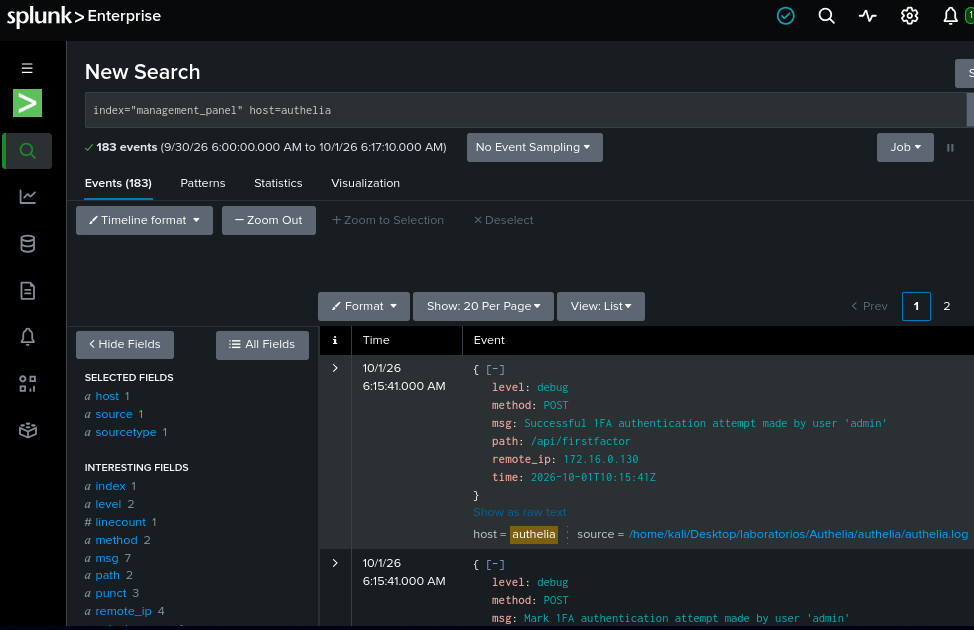
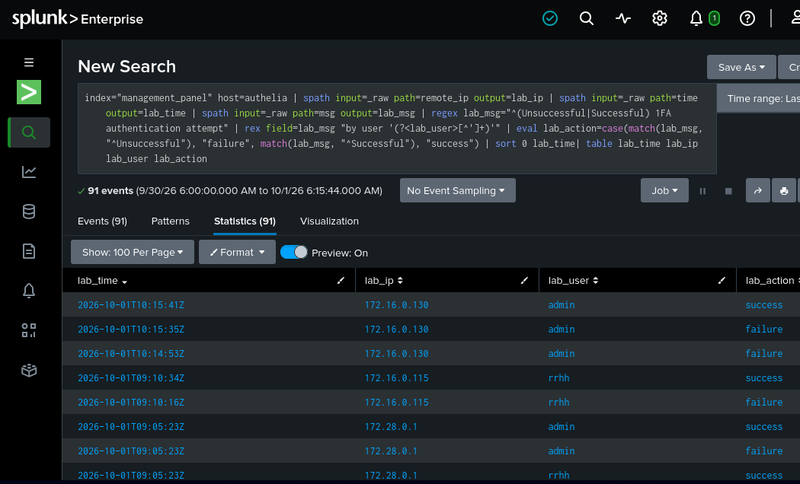
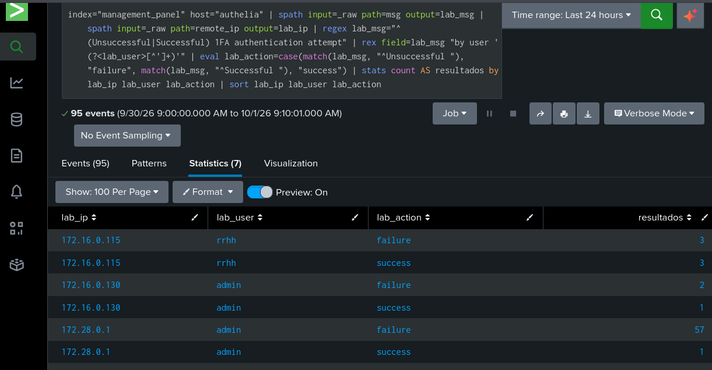

## Context

Before looking for events, I made some login requests using other IPs. 172.16.0.115 will be from RRHH and 172.16.0.130 will be from the admin. So we have to assume that the hacker can't change their IP, well, they can, but we use a Caddy proxy to deny the param "X-Forwarded-For" so that only the real IP is received. So I made this to filter and differentiate between false positives.

172.16.0.115 -> user: RRHH
172.16.0.130 -> user: admin
172.28.0.1 ---> user: Pentester

## Objectives

My objective is to detect and analyze suspicious authentication activity, and to document a reproducible response with evidence.

## Telemetry

So as I said before, we need to be organized, so I will start by looking at the telemetry that we get.



Then I will apply a regex and change some variable names using Splunk SPL to make this clearer.

```spl
index="management_panel" host=authelia | spath input=_raw path=remote_ip output=lab_ip | spath input=_raw path=time output=lab_time | spath input=_raw path=msg output=lab_msg | regex lab_msg="^(Unsuccessful|Successful) 1FA authentication attempt" | rex field=lab_msg "by user '(?<lab_user>[^']+)'" | eval lab_action=case(match(lab_msg, "^Unsuccessful"), "failure", match(lab_msg, "^Successful"), "success") | sort 0 lab_time| table lab_time lab_ip lab_user lab_action
```




At this point I'm gonna filter by ip, users, and how many failure and successful

```spl
index="management_panel" host="authelia" | spath input=_raw path=msg output=lab_msg | spath input=_raw path=remote_ip output=lab_ip | regex lab_msg="^(Unsuccessful|Successful) 1FA authentication attempt" | rex field=lab_msg "by user '(?<lab_user>[^']+)'" | eval lab_action=case(match(lab_msg, "^Unsuccessful "), "failure", match(lab_msg, "^Successful "), "success") | stats count AS resultados by lab_ip lab_user lab_action | sort lab_ip lab_user lab_action
```
We can observe that something goes wrong... why is there many failure attempts of user admin, and also all this massive failure error come from one specific IP



We got:

| Users | Failure | Success |
|-------|---------|---------|
| rrhh  | 3       |   31    |
| admin | 59      |   2     |

## Chronology

At this point I'll review the autentications chronology by IP. I observe that there a intercalation between users acounts during the lab.
My hypothesis is that one IP could be getting a lot of failures agains an acount and success access repeaded with another account showing an unusual pattern. Why? maybe to avoid the rate limit ban wheel guess random passwords.

Atlist to me this could be a kind of "Possible force brute with interspersing valid autentications" I can't ignore this unusual bahavior

During a block of 60sec I'll look for this coincidences

| Condition | Initial Proposal |
|-----------|------------------|
| Origin | Same IP |
| Failed attempts | At least 6 failures against the same account A |
| Successful authentications | At least 3 successes with an account B different from A |
| Time relationship | Both behaviors within the same window |

This allows me to detect the behavior even if the attacker has not yet guessed the correct password. If a successful login does occur, we will check its timing relative to the failed attempts and determine whether the protected resource was subsequently accessed.

## Notes:

I had problems with the interpreter time, it was desynchronized by seconds between Splunk and Authelia time logs. The solution was changing the time parameters of Splunk and restarting it.


